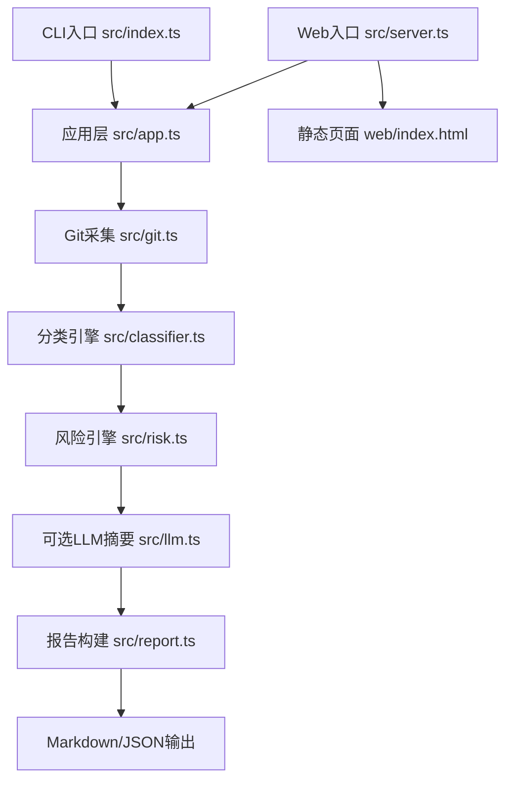
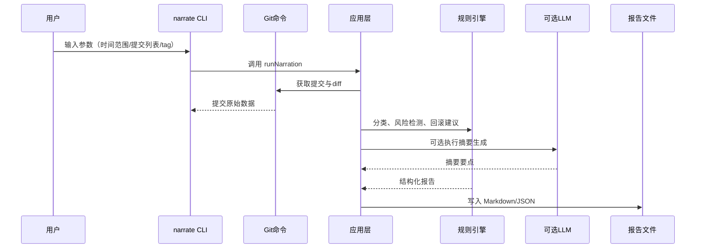

# 架构设计

## 总体架构

## 技术栈
- **后端:** Node.js 运行时 + TypeScript
- **前端:** 无（CLI 工具）
- **数据:** 无持久化数据库，数据来源为本地 Git 仓库

## 核心流程

## 重大架构决策
完整的ADR存储在各变更的how.md中，本章节提供索引。

| adr_id | title | date | status | affected_modules | details |
|--------|-------|------|--------|------------------|---------|
| 暂无 | 暂无 | 暂无 | 暂无 | 暂无 | 暂无 |
